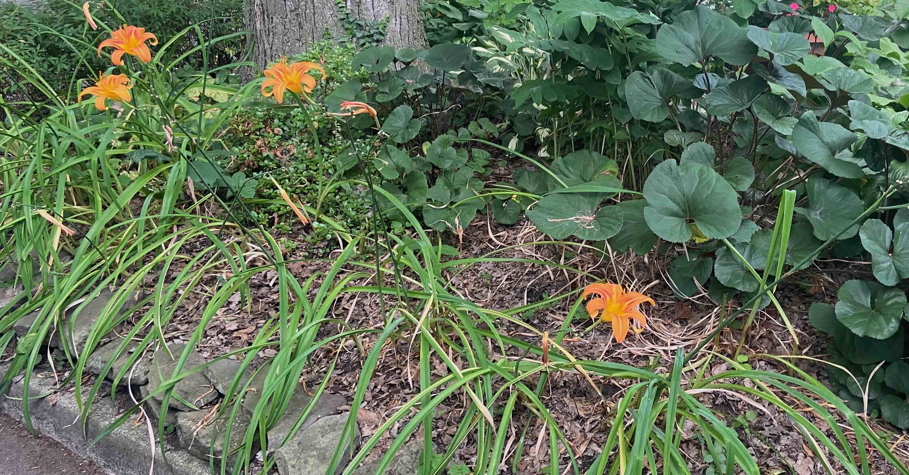

This is not a very exciting post!

# The lilies

Our front yard has a small patch of day lilies.  Several years ago, I
started to count the number of lilies open each day. I missed some
days, and in 2024 we were not at home after June 30.

<figure>
    
    <figcaption>Day lilies at the end of the 2025 season</figcaption>
</figure>

# Counts

I kept count of number of lilies flowering each day in a simple text
file. Each line represents a year. The line starts with the first day
of flowering. Subsequent numbers represent the counts on successive
days; `NA` is used for counts on days I missed. I used simple editor
commands to transform this into a JSON array of objects.  Each object
represents a year, with `start` and `count` fields. JavaScript
transforms this object into columns displayed in the table below.

<table id="daily-table" class="display" style="width: 100%">
    <thead>
        <tr>
            <th>Date</th>
            <th>Count</th>
        </tr>
    </thead>
    <tbody>
        <!-- Data will be populated here by DataTables -->
    </tbody>
</table>

# Visualization

Properties of flowering phenology are conveniently summarized by a
plot of cumulative count versus date. Flowering started around June 25
in 2022, 2023, and 2025; for some reason flowering in 2024 started
more than a week earlier (June 17). Daily counts increased to a
more-or-less constant rate (maybe weakly bimodal?). The total number
of flowers in 2025 (530) was noticeably greater than the number in
other years (320 - 370). This was due to production of more flowers
per day, rather than to a longer flowering period.

Lines are colored using the 'Hue / Saturation / Lightness' (HSL)
scale. All lines have the same hue and saturation; years progress from
lighter to darker values.

# Notes

I prototyped this in *R*, where I am very proficient. In JavaScript,
the JSON data were transformed to a more normalized form and displayed
using the [DataTables][] library. Plots were done using
[Plotly.js][]. Google Search Gemini AI helped me through various
programming obstacles.

I used a JavaScript ES module to isolate the code from text. Gemini
pointed me to an `importmap` to help import [DataTables][]; plots are
a simple import of the [Plotly.js][] JavaScript library.

[DataTables]: https://datatables.net/
[Plotly.js]: https://plotly.com/javascript/
